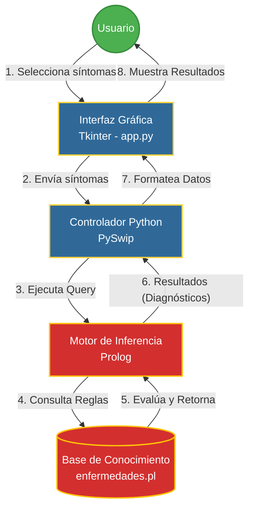

# Simulador de Sistema Experto Médico

Este proyecto es un simulador de un sistema experto médico desarrollado en Python y Prolog. Utiliza una interfaz gráfica de usuario (GUI) creada con Tkinter para que los usuarios puedan seleccionar sus síntomas, y un motor de inferencia en Prolog (usando la biblioteca `pyswip`) para diagnosticar posibles enfermedades basándose en una base de conocimientos.

## Características

- **Interfaz Intuitiva:** Interfaz gráfica simple y clara desarrollada con Tkinter.
- **Motor de Inferencia Prolog:** Utiliza reglas lógicas definidas en Prolog para el diagnóstico.
- **Base de Conocimientos:** Archivo `enfermedades.pl` donde se definen las enfermedades y sus síntomas asociados.
- **Diagnóstico Basado en Coincidencias:** Calcula el número de síntomas que coinciden y muestra las enfermedades más probables.

## Requisitos

- Python 3.x
- SWI-Prolog instalado en el sistema.
- Biblioteca de Python `pyswip`:
  ```bash
  pip install -r requirements.txt
  ```

## Cómo ejecutar

1. Asegúrate de tener SWI-Prolog instalado y configurado correctamente (incluido en el PATH de tu sistema).
2. Ejecuta el archivo principal:
   ```bash
   python app.py
   ```

## Arquitectura del Sistema

El siguiente diagrama detalla cómo interactúan los diferentes componentes del sistema experto, desde que el usuario ingresa sus síntomas hasta que se muestra el diagnóstico:



## Estructura de Archivos

- `app.py`: Archivo principal de Python. Contiene la lógica de la interfaz de usuario y la comunicación con Prolog.
- `enfermedades.pl`: Archivo de reglas de Prolog (Base de conocimientos) que vincula enfermedades con sus respectivos síntomas.
- `requirements.txt`: Archivo con las dependencias de Python necesarias.
